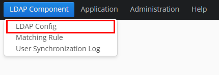
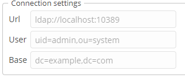
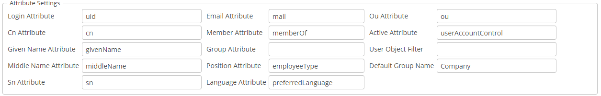

# Table of Contents

- [Overview](#overview)
- [Getting Started](#getting-started)
    - [Prerequisites](#prerequisites)
    - [Installation](#installation)
    - [Additional Information](#additional-information)
- [Features](#features)
- [Configuration](#configuration)
- [API](#api)
- [Known Issues](#known-issues)

# Overview

The LDAP Integration CUBA component provides a readily available instrument for employing features of a directory
server, e.g. Active Directory, in any CUBA-based application.
The component is available for CUBA applications of any complexity and does not require any additional third-party 
frameworks or libraries to be installed.

The component comprises the following functionalities:

* Storing user credentials in the LDAP database;
* Using Single Sign-On without having to specify user credentials;
* Configuring LDAP parameters and the directory server schema;
* Setting up rules for assigning roles and access groups to users.

# Getting Started

## Prerequisites

Before enabling the component, it is required to configure a directory server, so that it was accessible for the 
component features, and set up LDAP connection parameters.

## Installation

To add the LDAP component to your project, the following steps should be taken:

1. Add a custom application component to your project via CUBA Studio.

* Artifact group: *com.haulmont.addon.ldap*
* Artifact name: *ldap-global*
* Version: *add-on version*

When specifying the component version, you should select the one, which is compatible with the platform version used
in your project.

| Platform Version | Component Version |
|------------------|-------------------|
| 6.8.1            | 0.1-SNAPSHOT      |

2. Before using the component as a part of your application, it is vital to configure initial values for connecting to
the LDAP server, and to set up basic attribute names for the LDAP user in the *app.property* file.
An example of how to set up these properties is given below.

```properties
ldap.contextSourceUrl = ldap://localhost:10389
ldap.contextSourceBase = dc=example,dc=com
ldap.contextSourceUserName = uid=admin,ou=system
ldap.contextSourcePassword = secret
```

## Additional Information

You should keep in mind, that the LDAP component should be installed for each CUBA application, which is expected to use
Single Sign-On.

# Features

## LDAP Config

Once you have successfully installed the component, check that all configured property values are displayed properly 
on the LDAP Config screen (Menu: LDAP Component → LDAP Config).



### LDAP Connection

The 'Connection' tab of LDAP Config Screen allows amending and testing LDAP connection properties right from the
application UI.



Clicking the 'Test' button launches connection testing. If the connection is successfully established, the corresponding
message is displayed.

### Basic Attributes

Using the 'Basic Attributes' tab of Load Config Screen enables to match LDAP basic attributes and fields of the User
entity in your application.




### LDAP Schema

## LDAP Matching Rules

### Programmatic Rule

### Default Rule

### Simple Rule

### Scripting Rule

## Testing LDAP Matching Rules

## User Synchronization Log

# API

# Known Issues