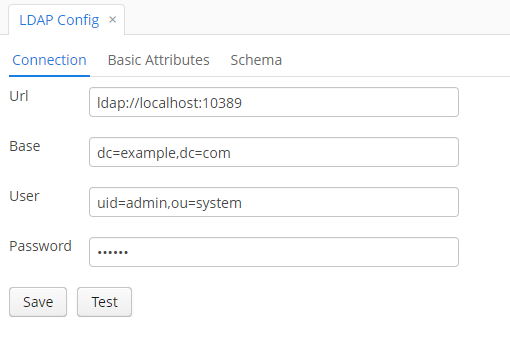

<p>
    <a href="http://www.apache.org/licenses/LICENSE-2.0"></a>
    <a href="https://travis-ci.org/cuba-platform/ldap-addon"></a>
</p>

- [Overview](#overview)
- [Getting Started](#getting-started)
    - [Prerequisites](#prerequisites)
    - [Installation](#installation)
    - [Additional Information](#additional-information)
- [Component Functionalities](#component-functionalities)
    - [LDAP Config](#ldap-config)
    - [LDAP Matching Rules](#ldap-matching-rules)
    - [Testing LDAP Matching Rules](#testing-ldap-matching-rules)
    - [LDAP Log](#ldap-log)
- [Scheduled Task Configuration](#scheduled-task-configuration)
- [EventListeners to Interact with LDAP Add-on Events](#eventlisteners)
- [Appendix A. Application Properties](#appendix-a-application-properties)

# Overview

The LDAP integration CUBA component provides readily available instruments for employing features of a directory
server, e.g. Active Directory, in any CUBA-based application.
The component is available for CUBA applications of any complexity and does not require any additional third-party
frameworks or libraries to be installed.

The component provides the following functionalities:

* Authentication in CUBA applications using LDAP credentials;
* Configuration of rules for assigning roles and access groups to users;
* Population of user details from the LDAP server;
* Logging LDAP synchronization details.

# Getting Started

## Prerequisites

Before enabling the add-on, it is required to configure a directory server, so that it will be accessible for the add-on features.

## Installation

To add the LDAP component to your project, the following steps should be taken:

1. Open your application in CUBA Studio.

2. Edit *Project properties*.

3. Click the plus button in the *App components* section of the *Main* tab.

    

4. Specify the coordinates of the component in the corresponding field as follows: group:name:version.

   * Artifact group: *com.haulmont.addon.ldap*
   * Artifact name: *ldap-global*
   * Version: *add-on version*

    

  When specifying the component version, you should select the one, which is compatible with the platform version used
    in your project.

| Platform Version | Component Version |
|------------------|-------------------|
| 7.0.x            | 1.3.1             |
| 6.10.x           | 1.2.0             |
| 6.9.x            | 1.1.1             |
| 6.8.x            | 1.0.1             |


5. Click *OK* to confirm the operation.

6. Before using the component as a part of your application, it is vital to configure initial values for connecting to
the LDAP server, and to set up basic attribute names for the LDAP user in the `app.properties` file.
An example of how to set up these properties is given below. Learn more about the application properties in  [Aappendix A](#appendix-a-application-properties).

```properties
ldap.contextSourceUrl = ldap://localhost:10389
ldap.contextSourceBase = dc=example,dc=com
ldap.contextSourceUserName = uid=admin,ou=system
ldap.contextSourcePassword = secret
ldap.referral = follow
ldap.sessionExpiringPeriodSec = 120
ldap.userSynchronizationBatchSize = 100
ldap.userSynchronizationOnlyActiveProperty = true
ldap.cubaGroupForSynchronization = company
ldap.cubaGroupForSynchronizationInverse = false
ldap.synchronizeCommonInfoFromLdap = true
cuba.web.standardAuthenticationUsers = admin,anonymous

```

7. Specify the following properties in the `web-app.properties` file:

```properties
cuba.web.standardAuthenticationUsers = admin,anonymous
ldap.expiringSessionNotificationCron = */10 * * * * *
ldap.addonEnabled = true
ldap.expiringSessionsEnable = true
```

**Note:** By default, if the component is enabled, users cannot log in to the system using CUBA credentials. However,
you can permit particular users (e.g. system administrators) to log in using CUBA credentials by specifying their usernames
as values of the `cuba.web.standardAuthenticationUsers` property.

## Additional Information

You should keep in mind that the LDAP component should be enabled for each CUBA application, which is expected to use
its functionalities.

# Component Functionalities

## LDAP Config

Once you have successfully installed the component, check that all configured property values are displayed properly
on *LDAP Config* screen (Menu: *LDAP Component → LDAP Config*).


The screen comprises three sections: *Connection settings*, *Attribute Settings* and *Schema Settings*. The description
of each section is given below.

### LDAP Connection Settings

The *Connection settings* section of *LDAP Config* screen is designed to view and test LDAP connection properties from the application UI.



Clicking the *Test Connection* button at the bottom of the screen launches connection testing. If the connection is
successfully established, the corresponding message is displayed.

### Attribute Settings

When a user logs in using LDAP credentials for the first time, a new `User` entity is created in the CUBA application.
All details about the user are taken from the LDAP server side (configuring these details is a part of preparation
activities). In order to match LDAP attributes and the fields of the `User` entity, use the *Attribute Settings* section.


**Tip**: Move the cursor over the field names to read their descriptions.

### LDAP Schema

The *Schema Settings* section enables to configure a set of rules that define what can be stored as entries in the LDAP
directory.


Using the table provided in the section, it is possible to set up attributes that can be used as conditions for
matching rule application.

Clicking the *Refresh LDAP Attributes* button uploads all attributes of the specified LDAP
user object class. However, it is possible to add attributes manually by using the *Create* button.

## LDAP Matching Rules

LDAP matching rules are special rules for configuring access rights for new application users (those created after
logging in via LDAP). There are four rule types intended for this purpose: custom, default, simple and scripting.
Creating and managing LDAP matching rules is available from *LDAP Matching Rule* screen (Menu: *LDAP Component →
LDAP Matching Rules*).


The screen comprises the table of matching rules and the section for testing how the existing matching rules can be
applied to a particular user (see [Testing LDAP Matching Rules](#testing-ldap-matching-rules)).
Using the table, it is possible to enable/disable certain rules by ticking checkboxes in the *Active* column.

Another important thing is that rules have their order numbers, according to which they are applied.
The default rule is always applied the last.

The description of all rule types and their peculiarities is provided in the sections below.

### Custom Rule

The LDAP component provides means to process custom rules defined programmatically. These rules can be created only by
adding new classes to the classpath of your application. These classes should be implemented as Spring beans and
provided with the `@LdapMatchingRule` annotation.
Custom rules can be viewed from the application UI, however, they cannot be configured or amended there.

One of the advantages of custom rules is that they allow specifying additional conditions not related to LDAP attributes
or schema. The example of a custom rule is provided below.

```java
@Component
@LdapMatchingRule(name = "Custom Rule 1", condition = "Test Rule")
public class TestCustomRule implements CustomLdapMatchingRule {
    @Inject
    private LdapUserDao ldapUserDao;

    @Inject
    private CubaUserDao cubaUserDao;

    @Override
    public boolean applyCustomMatchingRule (LdapMatchingRuleContext ldapMatchingRuleContext) {
        if (ldapMatchingRuleContext.getLdapUser().getLogin().equalsIgnoreCase("barts")) {
            User admin = cubaUserDao.getCubaUserByLogin("admin");
            ldapMatchingRuleContext.getRoles().add(admin.getUserRoles().get(0).getRole());
            ldapMatchingRuleContext.setGroup(admin.getGroup());
        }
        return true;
    }
}
```

### Default Rule

When launching your application for the first time after the component installation, the default rule is automatically
created in the system.

It is used if none of other rules were applied, i.e. conditions for applying existing rules were not met.
That is why it contains the `LAST` value in the *Order* field.

The default rule can be amended by clicking the *Edit* button. All fields and settings present in *Default
Matching Rule Editor* are described in the section below.

#### Default Matching Rule Editor


* *Description* — a short description of the default rule.
* *Terminal rule* — if checked, then rules coming after the current one (according to the rule order) are not applied.
* *Access group* — an access group to be assigned to a user, if the default rule is applied.
* *Override existing access group* — if checked, then an access group that was previously assigned to a user is removed
and the group specified in the *Access group* field is used instead.
* *Override existing roles* — if checked, then all roles that were previously assigned to a user are removed and the ones
specified in the 'Roles' section are used instead.

The *Roles* table allows creating a set of roles, which are assigned to a user, if the default rule is used.

### Simple Rule

Simple rules allow granting access rights (by assigning an access group and roles) to users, if particular conditions are met.
To create a simple rule, select the *Create Simple Rule* option from the menu of the *Create Matching Rule* button.

#### Simple Matching Rule Editor


*Simple Matching Rule Editor* comprises settings and tables for configuring simple matching rules:

1. __General details and settings__. The fields are similar to the ones described in [Default Matching
Rule Editor](#default-matching-rule-editor).
2. __Conditions__. The section enables to add conditions, which have to be met for successful rule application. Clicking
the *Create* button opens *Simple Rule Condition Editor*.


The editor contains the following fields:

* *Attribute* — defines an LDAP attribute, which will be checked before applying a current simple rule.

 **Note:** Before creating conditions it is required to add them to the existing LDAP Schema (for more details, please
refer to [LDAP Schema](#ldap-schema)).

* *Attribute Value* — defines a value of the selected attribute. The rule will be applied to those user entities, which
have the specified value of the selected attribute.


3. **Roles**. The section is designed to add user roles, which will be assigned to a user in case of successful rule
application.

### Scripting Rule

Using scripting rules it is possible to specify a Groovy script with a set of conditions to be met to grant a user
access rights. You can create a new scripting rule by selecting the *Create Scripting Rule* option from
the menu of the *Create matching rule* button.

#### Scripting Matching Rule Editor

*Scripting Matching Rule Editor* comprises a set of general fields (these fields are similar to the ones described in
[Default Matching Rule Editor](#default-matching-rule-editor)), a section for specifying and testing Groovy scripts,
and a table of roles.


An entered condition is evaluated using LDAP matching rule context. Note that the `{ldapContext}` placeholder should
be used as an alias of the LDAP matching rule context. The `{ldapContext}` provides the following fields:

* *ldapUser* — defines the main LDAP person properties (login, cn, sn, email, memberOf, accessGroups, isDisabled, position,
language, ou).
* *appliedRules* — matching rules, which were previously applied to the context.
* *roles* — roles, which were previously assigned to a user.
* *group* — a current access group that a user belongs to.
* *cubaUser* — a CUBA user, to whom a current matching rule is applied.
* *isTerminalRuleApply* — signals that a current rule is a terminal one, i.e. once it is used, no other rules can be applied.

## Testing LDAP Matching Rules

After creating all required matching rules, it is possible to test them right from *LDAP Matching Rule* screen. For this
purpose, enter a user login in the corresponding field and click *Test Rules*.

After that, the applied matching rules and roles are displayed in the corresponding tables and, also, the assigned access
group is shown in the *Group* field. This functionality is useful if it is required to find out whether a rule is
applied correctly.

## LDAP Log

*LDAP Log* screen can be used to view all activities related to LDAP connection from the application UI,
including user authentication checks, rule application, updates of user properties and errors that occur while the component
features are used.


In order to view any log entry, just double-click it or select it in the table and click the *View* button.

Clicking the *Excel* button enables to download details of the selected rows (or all rows if required) to an `*.XLS` file.

# Scheduled Task Configuration

Before setting up scheduled tasks, make sure that [application properties](#appendix-a-application-properties) are
configured in the `web-app.properties` and `app.properties` files.

There are several scheduled tasks that can be configured for the LDAP component:
* `checkExpiredSessions()` — checks if a new access group or roles were assigned to the current user, or if he/she was
activated/deactivated.
* `killExpiredSessions()` — kills the current user session, if the user was activated/disabled or a new access group/set of roles was assigned to him/her.
* `synchronizeUsersFromLdap()` — synchronizes information about CUBA users in accordance with their state in LDAP.

In order to register scheduled tasks in your application, follow the guidelines below.

## Scheduled Task to Check User Sessions

1. Open *Menu: Administration → Scheduled Tasks*.
2. Click the *Create* button.
3. Fill in the required fields as follows:
    * *Bean Name:* `ldap_UserSynchronizationSchedulerService`
    * *Method Name:* `checkExpiredSessions()`
    * *Scheduling Type:* Cron
    * *Cron Expression:* specify a required cron expression (see [documentation](https://doc.cuba-platform.com/manual-latest/scheduled_tasks_cuba_reg.html) for more details)

  

4. Click *OK* to save the changes.
5. Activate the created task by clicking the corresponding button on *Scheduled Tasks* screen.

## Scheduled Task to Kill User Sessions

1. Open *Menu: Administration → Scheduled Tasks*.
2. Click the *Create* button.
3. Fill in the required fields as follows:
    * *Bean Name:* `ldap_UserSynchronizationSchedulerService`
    * *Method Name:* `killExpiredSessions()`
    * *Scheduling Type:* Cron
    * *Cron Expression:* specify a required cron expression (see [documentation](https://doc.cuba-platform.com/manual-latest/scheduled_tasks_cuba_reg.html) for more details)

  

4. Click *OK* to save the changes.
5. Activate the created task by clicking the corresponding button on *Scheduled Tasks* screen.

## Scheduled Task to Synchronize Users

1. Open *Menu: Administration → Scheduled Tasks*.
2. Click the *Create* button.
3. Fill in the required fields as follows:
    * *Bean Name:* `ldap_UserSynchronizationSchedulerService`
    * *Method Name:* `synchronizeUsersFromLdap()`
    * *Scheduling Type:* Cron
    * *Cron Expression:* specify a required cron expression (see [documentation](https://doc.cuba-platform.com/manual-latest/scheduled_tasks_cuba_reg.html) for more details)

  

4. Click *OK* to save the changes.
5. Activate the created task by clicking the corresponding button on *Scheduled Tasks* screen.

## Enabling Scheduled Tasks

1. Open *Menu: Administration → Application Properties*.
2. Set the value of the *cuba.schedulingActive* property to `true`.


Once the scheduled tasks are created and scheduling is enabled, the system will check user sessions once in a specified
period of time.

If there are any changes related to access groups, user roles or user status (i.e. activation/deactivation),
the system will show a notification that the current session is about to expire and, after a configured period, the user
session will be killed.

If user details change on the LDAP server side, CUBA user details will be updated as well.

# EventListeners to Interact with LDAP Add-on Events

In order to make your application react to events related to the LDAP component, you can register the `@Component` methods
as event listeners using the `@EventListener` annotation. The example of how to configure an event listener is given below:

```java
import org.springframework.context.event.EventListener;

@Component
public class LdapEventListener {

    @EventListener
    public void userCreatedFromLdap(UserCreatedFromLdapEvent event) {
      // handles user creation event
    }
}
```

## Event types

The application component supports the following LDAP event types:

*  `BeforeUserRolesAndAccessGroupUpdatedFromLdapEvent` — defines the state of a CUBA user before matching rules are applied, i.e.
before user roles and an access group are assigned.
*  `AfterUserRolesAndAccessGroupUpdatedFromLdapEvent` — defines the state of a CUBA user after matching rules are applied, i.e.
after user roles and an access group are assigned.
*  `UserCreatedFromLdapEvent` — describes the state when a new CUBA user is created after logging in using LDAP credentials.
*  `UserActivatedFromLdapEvent` — defines the state of a CUBA user that was previously inactive, and then activated.
*  `UserDeactivatedFromLdapEvent` — defines the state of a CUBA user that was previously active, and then disabled.

# Appendix A. Application Properties
There is a set of application properties to be configured before working with the component. These properties should be
provided in the `app.properties` and `web-app.properties` files of your application.

## `app.properties`

#### ldap.contextSourceUrl

* **Description:** defines a URL for reaching an LDAP server.
* **Default value:** ldap://localhost:10389

#### ldap.contextSourceBase

* **Description:** defines a base DN. If configured, all LDAP operations on contexts retrieved from this ContextSource
will be relative to this DN. Default is an empty distinguished name (i.e. all operations will be relative to the directory root).
* **Default value:** dc=springframework,dc=org

#### ldap.contextSourceUserName

* **Description:** indicates a username (principal) used for authentication. This is normally the distinguished name
of an admin user.
* **Default value:** uid=admin,ou=system

#### ldap.contextSourcePassword

* **Description:** defines a password used for authentication.
* **Default value:** secret

#### ldap.referral

* **Description:** defines the strategy to handle referrals, as described in [documentation](http://docs.oracle.com/javase/jndi/tutorial/ldap/referral/jndi.html).
* **Default value:** follow

#### ldap.sessionExpiringPeriodSec

* **Description:** indicates a period in seconds after which a user session is killed, if a user has been deactivated or
a new access group or matching rules have been assigned to him/her.
* **Default value:** 30

#### cuba.web.standardAuthenticationUsers

* **Description:** defines users that can log in to the system using standard CUBA credentials.
* **Default value:** admin,anonymous

#### ldap.userSynchronizationBatchSize

* **Description:** defines the number of users that can be synchronized during the execution of the
[`synchronizeUsersFromLdap()`](#scheduled-task-to-synchronize-users) scheduled task.
* **Default value:** 100

#### ldap.userSynchronizationOnlyActiveProperty

* **Description:** if set to `true`, the [`synchronizeUsersFromLdap()`](#scheduled-task-to-synchronize-users) scheduled task
updates only the value of the *Active* attribute. Otherwise, all user details are updated.
* **Default value:** true

#### ldap.cubaGroupForSynchronization

* **Description:** defines access groups that are checked when executing the [`synchronizeUsersFromLdap()`](#scheduled-task-to-synchronize-users)
scheduled task.
* **Default value:** company

#### ldap.cubaGroupForSynchronizationInverse

* **Description:** if set to `true`, then all groups except for the ones specified in `ldap.cubaGroupForSynchronization`
are checked executing the [`synchronizeUsersFromLdap()`](#scheduled-task-to-synchronize-users) scheduled task.
* **Default value:** false

#### ldap.synchronizeCommonInfoFromLdap

* **Description:** if set to `true`, then the [`synchronizeUsersFromLdap()`](#scheduled-task-to-synchronize-users) scheduled task
updates the values of the following fields of the User entity in accordance with their state on the LDAP server side:
 Email, Name, First name, Last name, Middle name, Position, Language).
* **Default value:** true

## `web-app.properties`

#### cuba.web.standardAuthenticationUsers

* **Description:** defines users that can log in to the system using standard CUBA credentials.
* **Default value:** admin,anonymous

#### ldap.expiringSessionNotificationCron

* **Description:** defines the cron expression for retrieving expired sessions from the middleware layer.
* **Default value:** */10 * * * * *

#### ldap.addonEnabled

* **Description:** if set to `true`, then the LDAP add-on is enabled.
* **Default value:** true

#### ldap.expiringSessionsEnable

* **Description:** if set to `true`, the system sends notifications to inform a user that his/her session is about to expire.
* **Default value:** true
